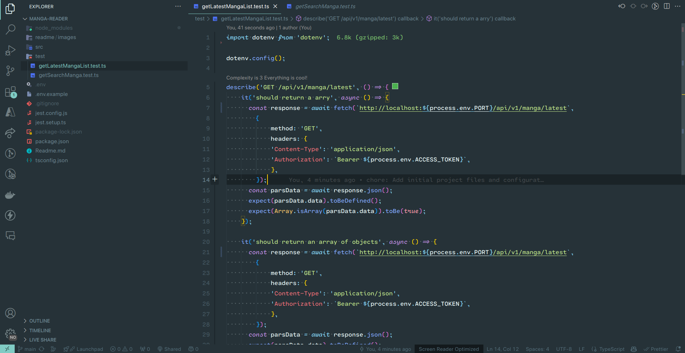

### Manga Reader Api 
<!--  -->
#### Description
Backend API for a manga reader application. This API provides manga data, chapter data, and page data.
The API is built using Node.js, Express.js, and Cheerio.js. The API scrapes.

#### Features

- Get all latest manga
- Get all manga
- Search manga
- Get manga details
- Get all chapters
- Get chapter details
- Get all pages

#### Installation

1. Clone the repository
```bash
git clone 
```

2. Install dependencies
```bash
npm install
```

3. Create and configure .env file from .env.example
```bash
cp .env.example .env
```

4. Start the server
```bash
npm dev
```

5. You can contact me to get this :D
```bash
BASE_URL=
```

#### What The Tech That I Use?

- Node.js
- Express.js
- Cheerio.js
- Axios
- Cors
- Dotenv
- Nodemon
- Morgan
- Typescript
- Jest

#### What I Learn?

- How to scrape data from a website
- How to build a RESTful API
- How to use Cheerio.js
- How to use Axios
- How to use Typescript
- How to use Jest

#### Contact or Contribute

- Gmail : ["klausdev2@gmail.com"]
- LinkedIn : ["https://www.linkedin.com/in/reda-ezziani-43a121295"]
- Github : ["https://github.com/redaezziani"]

#### Badges


